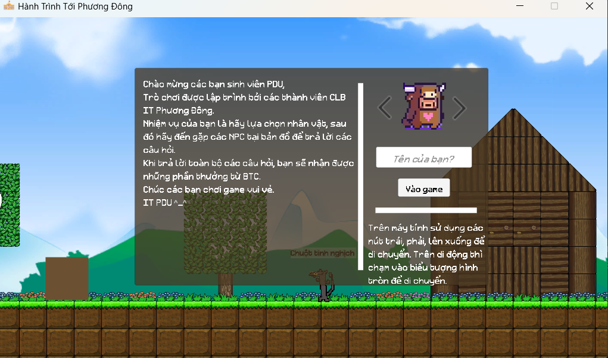

# 1.  Thông tin (Information)

- Trò chơi được thiết kế và xây dựng bởi toàn bộ thành viên CLB IT Phương Đông.
- Trò chơi thuộc dạng di chuyển, giải câu hỏi và tìm kiếm.

# 2. Cài đặt (Installation)

- Engine: Unity Engine 2022.3.43f

# 3. Tài nguyên (Assets)
- Mã nguồn (tệp script) được xây dựng bởi các thành viên trong CLB IT Phương Đông.
- Tài nguyên âm thanh, tilemap được sử dụng từ các nguồn miễn phí trên mạng.
- Hình ảnh nhân vật được thiết kế bởi Mai Linh (Thành viên CLB IT Phương Đông).

# 4. Giấy phép (License)
- Trò chơi được phát hành miễn phí và không có mục đích thương mại.
- Mọi người có thể tải về và chơi thử trò chơi này với mọi mục đích.